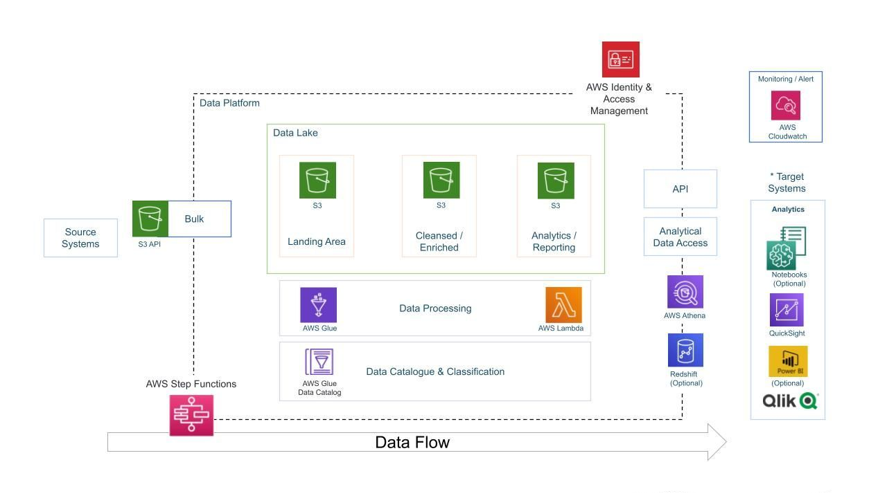

# Serverless-YouTube-Data-Analytics-Pipeline-on-AWS

## Overview
This project builds an automated big data pipeline for ingesting, processing, and analyzing YouTube video trend data at scale. It provides actionable insights into YouTube viewing patterns and video performance based on categories, channels, titles, and other attributes.

The pipeline follows modern data engineering best practices using a serverless architecture on AWS cloud platform. This enables secure, resilient, and cost-efficient analysis of large YouTube datasets.

## Architecture Diagram

## Pipeline Orchestration

The ETL process is orchestrated on AWS as follows:

- Streaming YouTube data lands into the S3 data lake
- Glue crawlers infer schema and populate Data Catalog
- Glue ETL jobs transform and process data at scale
- Cleansed data is stored back into S3
- Athena and QuickSight enable analysis and visualization

## Goals

- **Data Ingestion** - Implement mechanisms to ingest streaming YouTube data from multiple sources into cloud storage.
- **Scalable Data Processing** - Build reusable ETL pipelines that can transform raw data into analytical datasets at scale.
- **Cloud Data Lake** - Create a durable and secure data lake on cloud object storage for analytical workloads.
- **Managed Analytics** - Leverage serverless querying and visualization services to unlock insights.
- **Adaptive Capacity** - Implement auto-scaling infrastructure that can adapt to increasing data volumes.
- **Actionable BI** - Deliver interactive business intelligence dashboards for content creators and marketers.
  
## Cloud Services
The following managed AWS services are leveraged to build a secure, scalable, and serverless pipeline:

- **Amazon S3** - Provides highly durable and available object storage at scale for raw data and analytics results.
- **AWS Glue** - Fully managed ETL service to discover, prepare, and transform data for analytics.
- **AWS Athena** - Serverless interactive querying engine to analyze data directly in S3.
- **Amazon QuickSight** - Scalable business intelligence service to create interactive dashboards and visualizations.
- **AWS Lambda** - Enables running custom data processing code without managing servers.
- **AWS IAM** - Provides granular access controls, permissions, and encryption capabilities.

The serverless capabilities reduce operational overhead while usage-based pricing optimizes costs for analytical workloads that vary in utilization.

## Dataset
The analytics pipeline will ingest and process a comprehensive public dataset from **Kaggle** containing metadata on trending YouTube videos across multiple geographic regions collected over several months. The multi-dimensional dataset includes statistics like video titles, publishing channels, category IDs, publish dates, view counts, likes/dislikes, comment volumes, video descriptions, and thumbnail URLs. These attributes will enable an in-depth analysis of YouTube video performance and engagement across categories, channels, regions, and trends. The raw data encompasses thousands of trending videos in CSV files with one file per region. This rich dataset will fuel a diverse array of breakdowns and insights into YouTube viewing patterns, content optimization, and video trends based on the metrics and dimensions captured.

**Link:** https://www.kaggle.com/datasets/datasnaek/youtube-new
